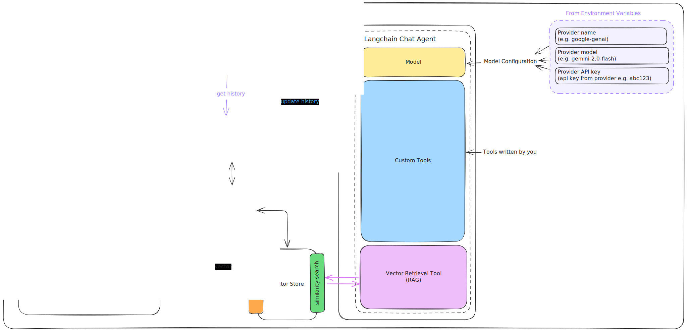

<div align="center">
  <a href="https://codecapsules.io/">
    
  </a>
</div>
<br/>

# Code Capsules Telegram Bot Agent

An Express API that exposes a Telegram Bot AI Agent. Built with TypeScript and LangChain with Telegram integration.

## Overview

This API provides a LangChain-based Telegram Bot Agent with RAG (Retrieval-Augmented Generation) capabilities. Integrations with Telegram allow the Agent to be prompted via a Telegram chat. It allows for the use of a Redis vector store and supports streaming responses for real-time chat interactions.

### Key topics:

- [Features](#features)
- [Setting up with Code Capsules](#setup)
- [Setting up a Vector Store](#vector-store-setup-redis)
- [Customisation](#customization)

## Features

### Telegram Bot Communication

Chat with the Agent via a Telegram Bot. To set up the bot, see [Telegram Bot Setup](#telegram-bot-setup)

### RAG (Retrieval-Augmented Generation)

Add contextual knowledge to the agent via:

- Plain text input
- URLs (automatically crawled and processed)
- Documents are embedded and stored in Redis for semantic search

### Streaming Responses

Real-time streaming chat responses using Server-Sent Events (SSE) for better user experience.

## Integration

### Code Capsules Integration

The following endpoints enable interaction from the Code Capsules Agent Capsule UI:

- `POST /api/chat/message/stream` - Stream chat responses
- `GET /api/chat/history` - Retrieve chat history

**Authentication**: These endpoints use a lightweight security model:

- Headers: `X-CC-API-KEY`, `X-CC-EMAIL`
- Environment: `INTERNAL_API_KEY`

The API validates `X-CC-API-KEY` against `INTERNAL_API_KEY` and uses `X-CC-EMAIL` as the user identifier. These are not required for the agent to function but enable Code Capsules chatbot integration.

## Setup

### Link Repo to an Agent Capsule in Code Capsules

To create your own Agent Capsule in Code Capsules with this functionaity:

1. [Create a new repo from this template](https://docs.github.com/en/repositories/creating-and-managing-repositories/creating-a-repository-from-a-template#creating-a-repository-from-a-template)
2. Create an AI Agent Capsule
3. Link your new repo to the capsule
4. Mark the capsule as 'using a Code Capsules template' and enter your provider, model, and API key details
5. Finish the setup and wait for the capsule to build

## Telegram Setup

### Create the bot in Telegram

1. Open Telegram and search for [BotFather](https://t.me/botfather)

   a. Type `/newbot` to create the bot

   b. When prompted, give the bot a name

   c. When prompted, give the bot a username

   d. Once created, the bot will provide you with a token. Copy this token and save it for later.

### Configure in your local environment

1. In your local environment, create a `.env` file and add the following:

```bash
TELEGRAM_BOT_TOKEN=your_bot_token
```

2. Save the changed environment variables
3. Restart your application

### Configure in your Capsule

1. Go to the **Config** tab of your Agent Capsule
2. Edit the environment variables using **Text Editor** and add the following:

```bash
TELEGRAM_BOT_TOKEN=your_bot_token
```

3. Save the changed environment variables
4. Wait for the capsule to restart. Once complete, your Agent Capsule will now expose your Telegram bot.

## Vector Store Setup (Redis)

By default, Code Capsules Agent templates cater for vector store logic using a Redis instance. This is NOT recommended for production as the instance data is not permanent - if the Redis instance restarts, it will lose all vector data.

### Via Code Capsules

To link a vector store through Code Capsules:

1. Create a new Redis Capsule
2. Go to the **Details** tab of your new Redis Capsule
3. Copy the **Connection string**
4. Go to the **Config** tab of your Agent Capsule
5. Edit the environment variables using **Text Editor** and add the following:

```bash
REDIS_URL=your_copied_connection_string
```

6. Save the changed environment variables
7. Wait for the capsule to restart. Once complete, your Agent Capsule will now use this Redis Capsule as its vector store.

> [!WARNING]
>
> **Please note:** Agent Capsule templates have been built with the capabilities of using either a Redis or in-memory vector store. When using the in-memory option (i.e. no Redis Capsule is linked), it is recommended to scale the Agent Capsule to the following in order to ensure optimal performance:
>
> - CPU 28%
> - Memory 1GB
> - Replicas 1
>
> To do this, visit the Agent Capsule [Scale](https://codecapsules.io/docs/agent-capsule/scale) page.

### Via local/other implementations

To link a vector store:

1. Start a new Redis instance using Docker.
2. Add the following as an environment variable to your agent:

```bash
REDIS_URL=your_redis_instance_url
```

3. Your Agent Capsule will now use this Redis Capsule as its vector store.

## Architecture

### Diagram



- **Vector Store**: Makes use of Redis as a vector database or a fallback Memory vector store to facilitate RAG functionality.
- **History**: Non-persistent Redis or In-Memory store. Can be easily expanded to be persistent.
- **Embeddings**: Uses Hugging Face Transformers embeddings model to embed text into a vector space locally.
- **Agent**: The core LangChain agent that handles the chat logic.
- **API**: API exposed via Express.js.

## Agent Tools

The Telegram Bot Agent has access to the following tools:

### 1. **retrieve**

- **Purpose**: RAG (Retrieval-Augmented Generation) tool for retrieving contextual information
- **Description**: Performs similarity search in the Redis vector store to find relevant documents
- **Input**: Query string
- **Output**: Retrieved documents with source metadata and content

## Installation

```bash
npm install
```

## Environment Variables

For local testing, create a `.env` file:

```bash

# App Configuration

PORT=3000
APP_URL=localhost:3000
APP_NAME=my-agent
DEV_MODE=false

# Security
# This is generated by Code Capsules on creation of the Agent capsule
INTERNAL_API_KEY=your-secret-key

# LLM Provider (Required)
PROVIDER_API_KEY=your-google-api-key
PROVIDER_NAME=google-genai
PROVIDER_MODEL=gemini-2.0-flash

# Vector Store (Optional, but recommended)
REDIS_URL=redis://localhost:6379

# Host documentation (Optional)
SHOW_DOCUMENTATION=true


# Telegram Bot (Required)
TELEGRAM_BOT_TOKEN=your-bot-token

```

## Scripts

To run

```bash
npm start
```

## API Endpoints

### Chat

- `POST /api/chat/message` - Send a message (non-streaming)

  - **Body**: `{ message: string }`
  - **Response**: Complete chat response
  - **Auth**: Required (`X-CC-API-KEY`, `X-CC-EMAIL`)

- `POST /api/chat/message/stream` - Send a message (SSE streaming)

  - **Body**: `{ message: string }`
  - **Response**: Server-Sent Events stream
  - **Auth**: Required (`X-CC-API-KEY`, `X-CC-EMAIL`)

- `GET /api/chat/history` - Get chat history for user
  - **Response**: Array of previous messages
  - **Auth**: Required (`X-CC-API-KEY`, `X-CC-EMAIL`)

### Context (RAG)

- `POST /api/rag/text` - Add text context to vector store

  - **Body**: `{ text: string }`
  - **Response**: Confirmation of context addition
  - **Auth**: Required (`X-CC-API-KEY`, `X-CC-EMAIL`)

- `POST /api/rag/url` - Add context from URL to vector store
  - **Body**: `{ url: string }`
  - **Response**: Confirmation of context addition
  - **Auth**: Required (`X-CC-API-KEY`, `X-CC-EMAIL`)

### Documentation

- `GET /api-docs` - Swagger UI (public, no auth required)
- `GET /swagger.json` - Swagger JSON (public, no auth required)

## Customization

### Change Auth

Edit `src/middleware/auth-user.ts` to change API authorization. By default, this uses the pre-described headers (`X-CC-API-KEY`, `X-CC-EMAIL`) and API key validation against `INTERNAL_API_KEY`.

### Change LLM Provider and/or Model

When using Code Capsules, changing the provider, model, and API key is easy via the Agent Capsule 'Config' page. For other implementations, edit the `PROVIDER_NAME`, `PROVIDER_MODEL`, and `PROVIDER_API_KEY` environment variables according to your requirements.

Supported providers include:

- `google-genai` (default)
- `openai`
- `anthropic`
- `mistralai`
- `groq`
- `cohere`
- `cerebras`
- `xai`

### Modify System Prompt

Update `src/modules/agent/config/system-prompt.ts` to change agent behavior, personality, or instructions. When using Code Capsules, be sure to ensure that the Agent Capsule is rebuilt and deployed to see your changes.

### Add or Remove Tools

**Add New Tools:**

1. Create a new tool class in `src/modules/agent/tools/implementations/` extending `BaseTool`
2. Implement the tool using LangChain's `tool()` function
3. Register the tool in `src/modules/agent/tools/tools-manager.ts`

**Remove Tools:**

1. Remove the tool import from `src/modules/agent/tools/implementations/index.ts`
2. Remove the tool registration from `src/modules/agent/tools/tools-manager.ts`

When using Code Capsules, ensure that the Agent Capsule is rebuild and deployed to see your changes.

### Change Vector Store

The RAG module currently uses Redis. To switch to another vector store (Pinecone, Weaviate, etc.), modify `src/modules/rag/services/vector-store.service.ts`.

## Tech Stack

- **Runtime**: Node.js + TypeScript
- **Framework**: Express 5
- **LLM Framework**: LangChain
- **LLM Provider**: Google Generative AI
- **Vector Store**: Redis (or Memory for fallback)
- **Documentation**: Swagger/OpenAPI
- **Telegram**: Telegram Bot

## Development Notes

- CORS is enabled for all origins (`*`)
- Request size limit: 10MB
- Swagger docs are publicly accessible at `/api-docs`
